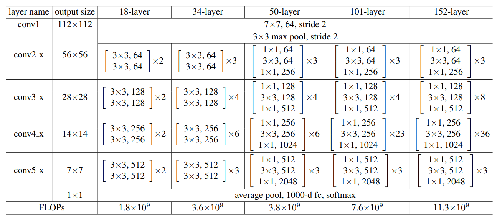
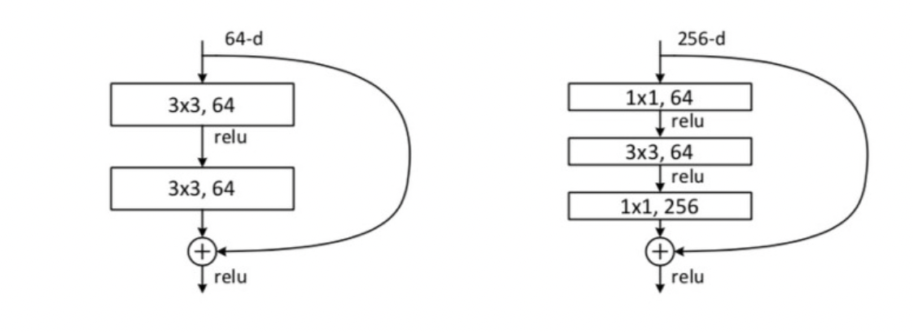

# ResNet PyTorch

ResNet 논문인 <a href ="https://arxiv.org/abs/1512.03385">Deep Residual Learning for Image Recognition</a> 각 모델 구조별 pytroch 구현

Resnet은 layer의 개수에 따라서 2개의 Residual Block으로 구분되며 Layer수가 18,34인 경우 좌측의 형태(bottle neck구조)를 쌓은 형태, 50,101,152 Layer인 경우  

s